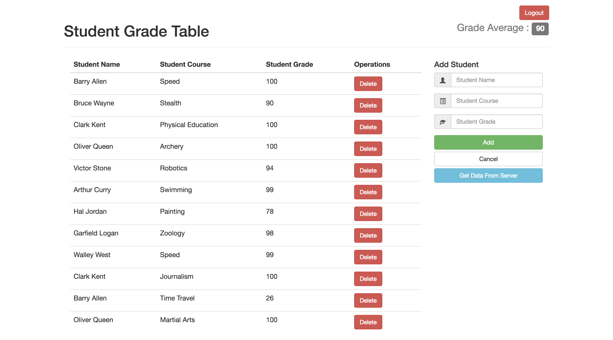

# Student Grade Table

## Technologies: HTML, CSS, Bootstrap, Javascript, jQuery, PHP, MySQL

## Description
My Student Grade Table is an application developed to allow users to create an profile then create students, courses, and their student's grades. Some cool features include a single form for adding and updating students, courses, and grades. All user data for students, courses, assignments and grades is held in a SQL database and accessed through the PHP. The application was developed using bootstrap for a mobile responsive experience.